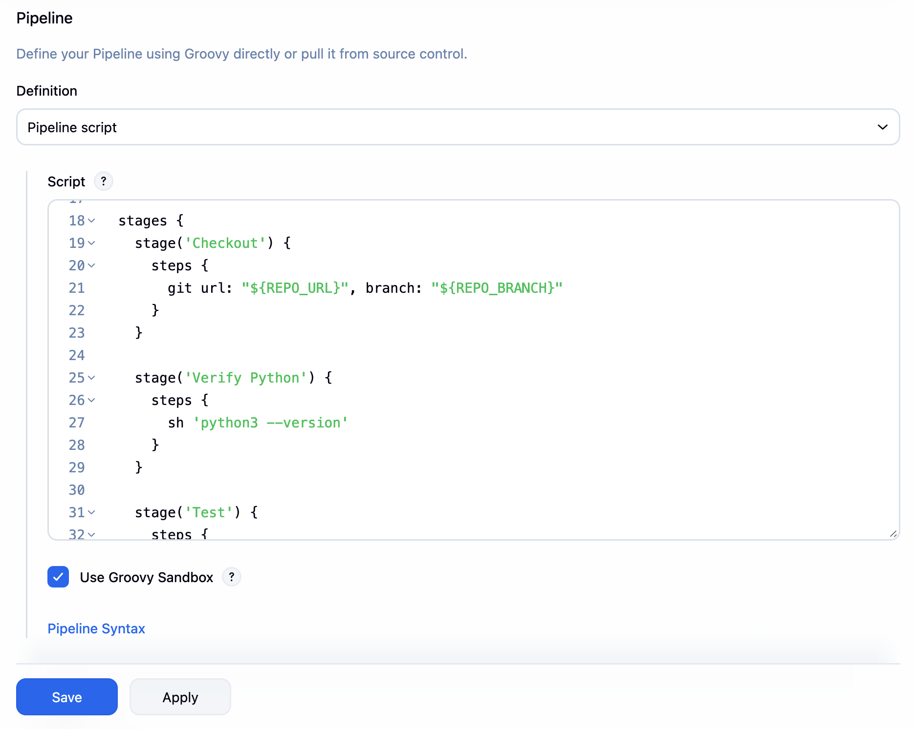
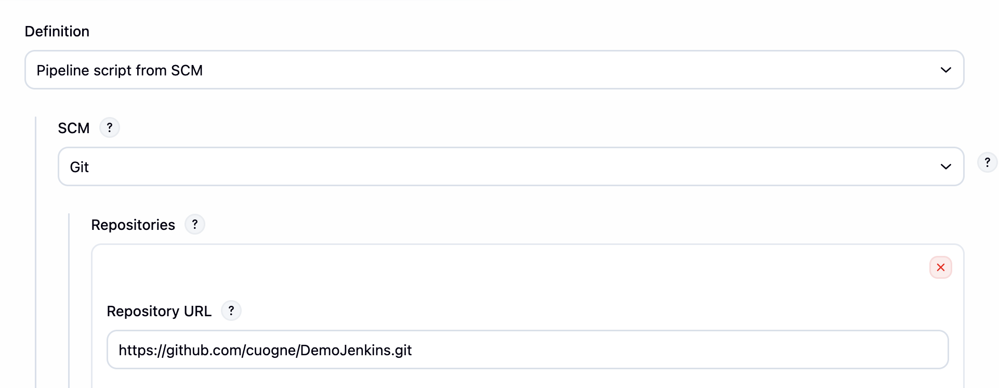

## Demo Jenkins

> This is a demo for Jenkins CI/CD pipeline for CSC11007 - Introduction to DevOps.

## Question 1:
1. Tạo job mới để chạy bài tập: "demo test ci-main" bằng script (ko dùng jenkinsfile)
+ point to github (5 phút quét)
+ script: chèn trực tiếp trong job

> Set Poll SCM: `H/5 * * * *` để Jenkins tự động quét repo sau mỗi 5 phút.

## Question 2:
2. Tạo job mới để chạy bài tập: "demo test ci-main" bằng Jenkinsfile
+ point to github (5 phút quét)
+ link tới jenkinsfile trong repo

> Để Jenkinsfile trong repo để Jenkins quét
> Branch mặc định trên jenkins là `master` (nhớ sửa)

## Question 3:
3. Add agent vào Jenkins with label: `for-testing`

## Question 4:
4. Update code chạy job trên Agent

## Question 5:
5. Tạo parameters trong Jenkins để có Option chạy test hay không ?
- Run test => dropdown: Yes/No
- Nếu chọn Yes => chạy stage test, nếu chọn No => ko chạy